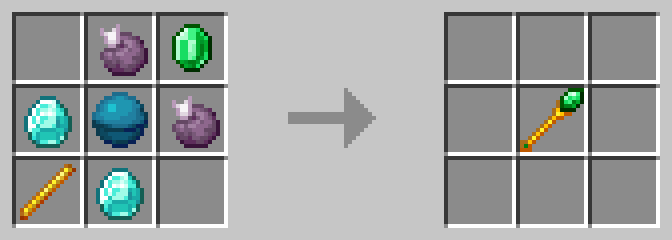
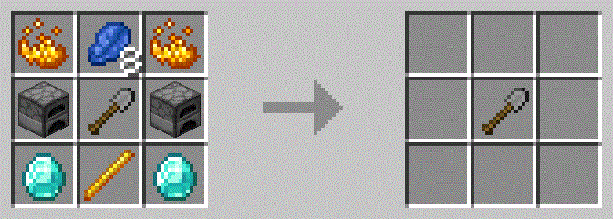

# RandomThings

This datapack adds a few cool things like items, spells([CraftingPlus]), etc.)

## Features

### Mana System
Mana is used by a few items in this datapack and slowly regenerates over time. 
It is displayed over the player hotbar, if the player is holding an item which uses mana.
A player can have a maximum of 100 mana.

### Block Breaker
When powered with redstone, breaks blocks infront of it.

### Hammers
There are 4 types of hammers:
* Stone Hammer
* Iron Hammer
* Gold Hammer
* Diamond Hammer

A hammer breaks blocks in a 3x3 area infront of the player

#### Recipes
##### Stone Hammer

##### Iron Hammer

##### Golden Hammer

##### Diamond Hammer

### Magic Wand
By itself the Magic Wand Does Nothing, but if a spell is applied to it, it can do cool things. Every spell uses a bit of mana when used.

#### Recipe

#### Spells
There are Spells that can only be applied to a Magic Wand:
* Small Meteorite
  * Summons a Fireball where the player is looking.
  * Uses 40 mana.
  * Recipe:

* Sight of the Enderman
  * Teleports the player to the position where he's looking (max. 50 blocks) 
  * Uses 50 mana
  * Recipe:

* Power of Zeus
  * Suommons a lightning bolt at the position the player is looking.
  * Uses 50 mana.
  * Recipe:

* Line of the Evoker
  * Summons a line of evoker fangs infront of the player and in the direction the player is looking.
  * Uses 65 mana.
  * Recipe:

* Circle of the Evoker
  * Summons a circle of evoker fangs around the player.
  * Uses 65 mana.
  * Recipe:

  
### Spawner Scepter
Can be used to mine a spawner and results in getting a **Cursed Mob Soul** of the mob in the spawner.
**Cursed Mob Souls** can be thrown into a cauldron to get back the spawner mined.
  
#### Recipe

### Spells
This datapack add various spells that can be applied to tools.
  
* Autosmelt
  * Can be applied to:
    * Stone Tools (Shovel, Pickaxe and Axe)
    * Iron Tools (Shovel, Pickaxe and Axe)
    * Golden Tools (Shovel, Pickaxe and Axe)
    * Diamond Tools (Shovel, Pickaxe and Axe)
  * Certain BLocks mined with this Spell applied will drop the smelted result of that block (for example: Iron Ore drops Iron Ingot)
  * Recipe:
  
* Veinmining
  * Can be applied to:
    * Golden Tools (Shovel, Pickaxe and Axe)
    * Diamond Tools (Shovel, Pickaxe and Axe)
  * Mines a vein of specific blocks in a radius of 7 blocks
  * Recipe:
  
* Reaping
  * Can be applied to:
    * Golden Hoe
  * Drops the spawn egg of some mobs when killed with the spell applied
  * Recipe:
  
  
### Luck Potion
This datapack adds a recipe for a luck potion.

#### Recipe

### Ring of Acceleration
A Ring that, when held in the mainhand, gives you extra speed

#### Recipe

### Death Chest
When a player dies a death chest tries to spawn with all the players items in it.
